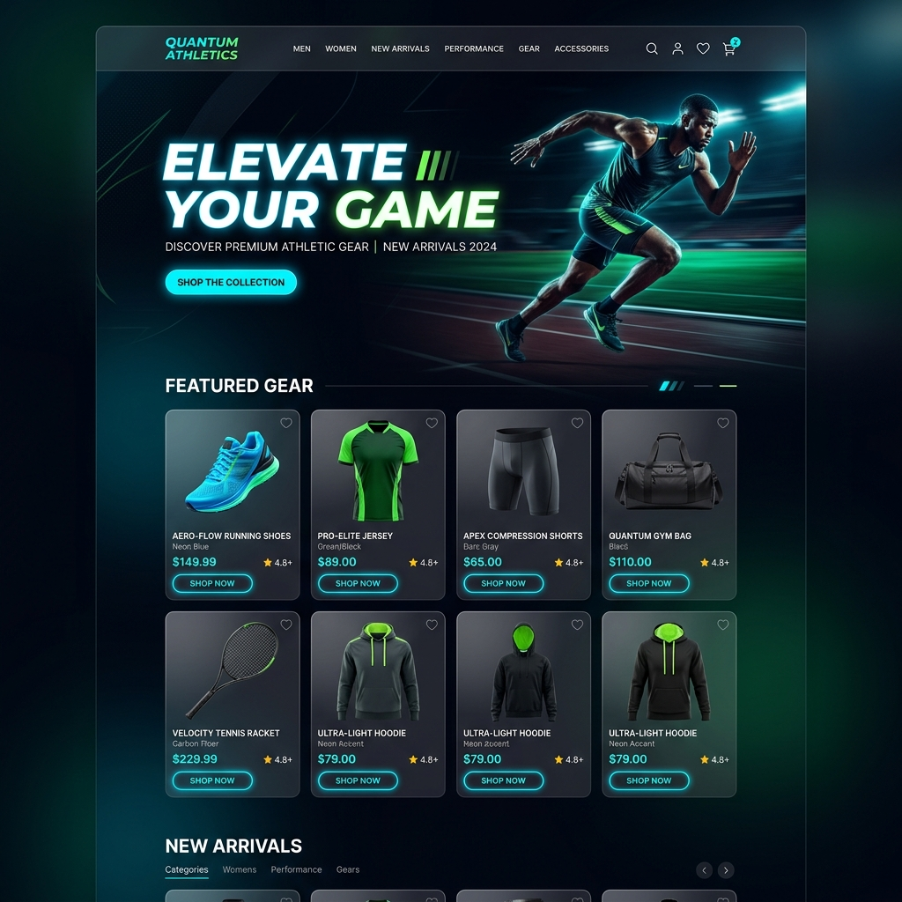
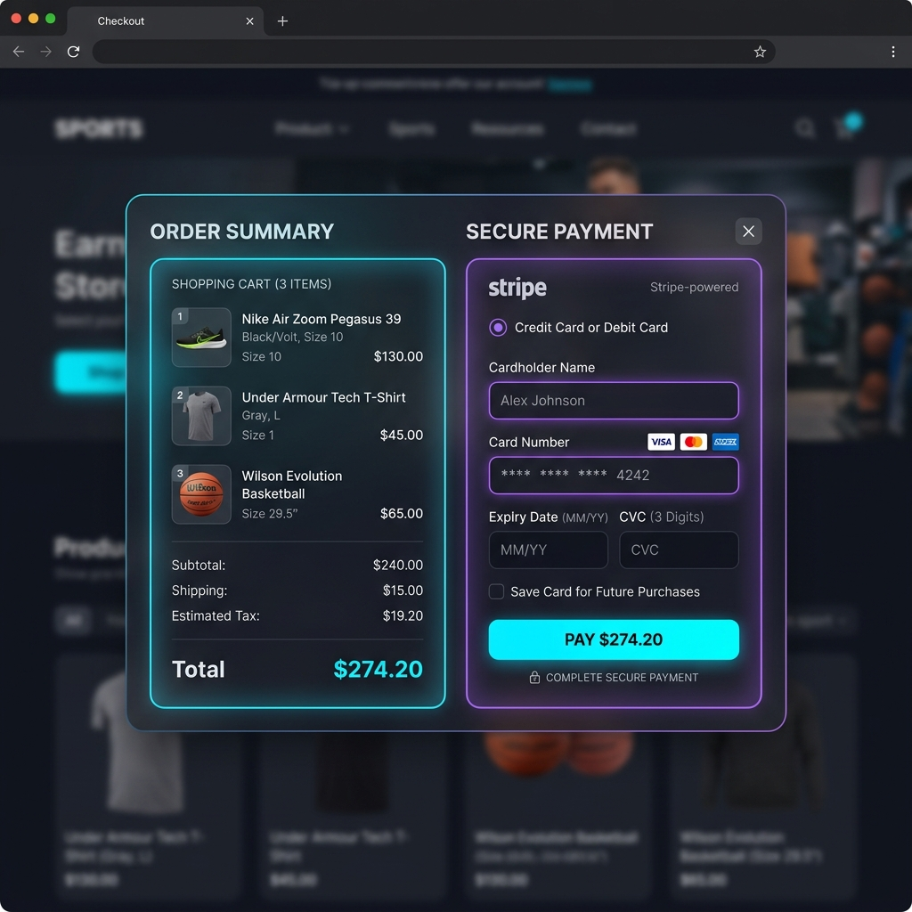

<div align="center">
  
  <h1>Sportix E-Commerce Platform</h1>
  <p>A high-performance, modern web application for premium sports gear, built with FastAPI and Vanilla JS.</p>
</div>

<p align="center">
  <a href="#features">Features</a> •
  <a href="#tech-stack">Tech Stack</a> •
  <a href="#installation">Installation</a> •
  <a href="#screenshots">Screenshots</a> •
  <a href="#architecture">Architecture</a>
</p>

---

##  Overview

Sportix is a feature-rich Single-Page Application (SPA) designed to provide a premium e-commerce experience. Focusing on performance and aesthetics, the platform utilizes a robust Python backend via **FastAPI** for lightning-fast API responses and a lightweight **Vanilla JavaScript** frontend featuring a dynamic theme system, custom glassmorphism components, and fluid state management.

Live Demo: [Sportix on Vercel]( https://sportix-kavin-s-projects13.vercel.app/) *(Placeholder)*

##  Key Features

- ** Secure Authentication**: JWT-based user login and registration system with role-based access control (Admin/User).
- ** Dynamic Cart & Wishlist**: Real-time cart calculations, coupon code validation, and persistent user wishlists.
- ** Payment Gateway**: Secure integration with Stripe's Payment Elements for PCI-compliant checkout flows.
- ** Theme Engine**: Seamless Dark/Light mode toggle powered by dynamic CSS variables.
- ** Admin Dashboard**: Comprehensive control panel featuring real-time `Chart.js` revenue analytics, order status management, and product CRUD operations.
- ** Responsive Design**: A mobile-first approach ensuring perfect layouts across all screen sizes.

##  Tech Stack

**Frontend:**
- HTML5 / CSS3 (Custom Design System, Glassmorphism)
- Vanilla JavaScript (ES6+ Modules, Fetch API)
- Chart.js (Analytics)
- Stripe.js (Payments)

**Backend:**
- Python 3.9+
- FastAPI & Pydantic
- SQLAlchemy (ORM) & SQLite (Database)
- Passlib & JWT (Security)
- Stripe Python SDK

**Deployment:**
- Vercel (Serverless Functions for Backend & Static Hosting for Frontend)

##  Screenshots

| Home Page | Checkout & Payment |
| :---: | :---: |
|  |  |

<div align="center">
  <b>Admin Dashboard Analytics</b><br>
  
</div>

##  Installation & Local Setup

### 1. Clone the Repository
```bash
git clone https://github.com/yourusername/sportix.git
cd sportix
```

### 2. Backend Setup
```bash
cd backend
python -m venv venv
source venv/bin/activate  # On Windows use `venv\Scripts\activate`
pip install -r requirements.txt
```

Set your environment variables (create a `.env` file or export them):
```bash
export STRIPE_SECRET_KEY="sk_test_..."
export SECRET_KEY="your_jwt_secret"
```

Start the FastAPI server:
```bash
uvicorn real_main:app --reload
```
*The API will be available at `http://127.0.0.1:8000`*

### 3. Frontend Setup
You can serve the `frontend/` directory using any static file server:
```bash
# Example using Python's built-in http.server
cd ../frontend
python -m http.server 3000
```
*Visit `http://localhost:3000` in your browser.*

##  License

This project is licensed under the MIT License - see the LICENSE file for details.
